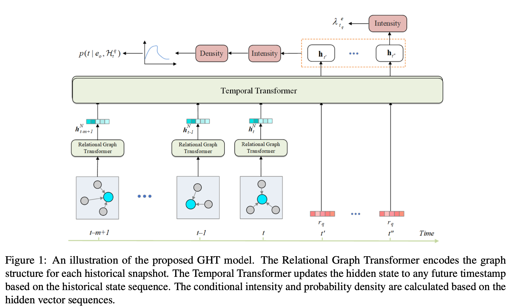

# GHT

This is the code for our EMNLP 2022 paper **Graph Hawkes Transformer for Extrapolated Reasoning on Temporal Knowledge Graphs**



### Train and Test

you can run as following:

```
python3 main.py --do_train --do_test
```

### Cite

```
@inproceedings{Haohai2022GHT,
 title={Graph Hawkes Transformer for Extrapolated Reasoning on Temporal Knowledge Graphs},
 author={Haohai Sun, Shangyi Geng, Jialun Zhong, Han Hu, Kun He.},
 booktitle={EMNLP},
 year={2022}
}
```
